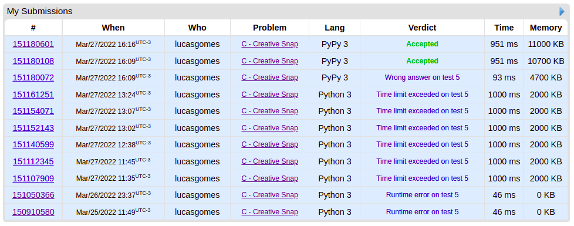
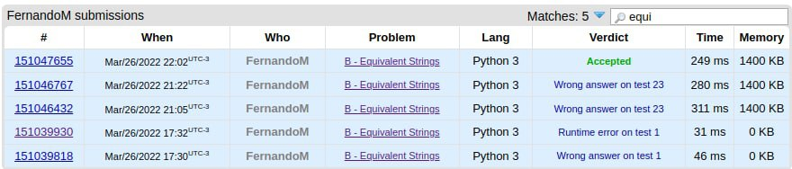
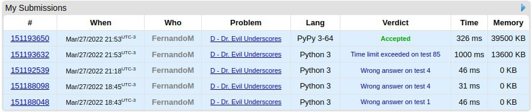

# Dupla02

**Número da Lista**: 4<br>
**Conteúdo da Disciplina**: D&C<br>

## Alunos
|Matrícula | Aluno |
| -- | -- |
| 17/0080102  |  Lucas Gomes Lopes |
| 19/0106565  |  Fernando Miranda Calil |

## Sobre 
Este projeto visa solucionar 3 problemas de dividir e conquistar do juiz online CodeForces.
Os problemas são:

* [1111C - Creative Snap](https://codeforces.com/problemset/problem/1111/C)

* [559B - Equivalent Strings](https://codeforces.com/problemset/problem/559/B)

* [1285D - Dr. Evil Underscores](https://codeforces.com/problemset/problem/1285/D)

## Screenshots

### Accepted do problema Creative Snap


### Accepted do problema Equivalent Strings


### Accepted do problema Dr. Evil Underscores


## Instalação 
**Linguagem**: Python<br>
**Framework**: Não Há<br>

Clone repositório:

```sh 
git clone git@github.com:projeto-de-algoritmos/D-C_Dupla02.git
```

## Uso 
Para executar os arquivos:

```sh 
python3 <nomedoarquivo>
```

## Outros 
Quaisquer outras informações sobre seu projeto podem ser descritas abaixo.


